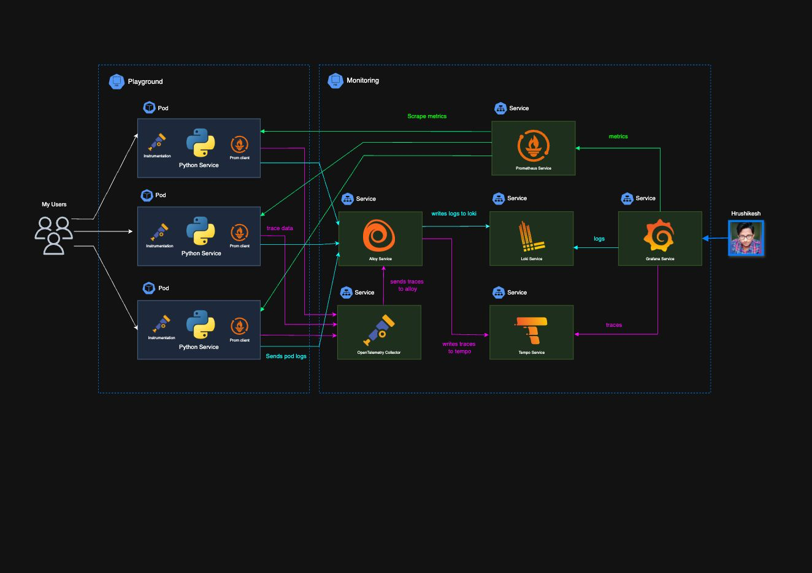
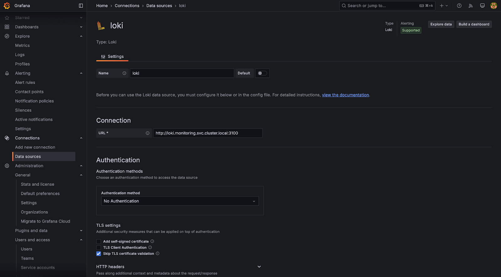
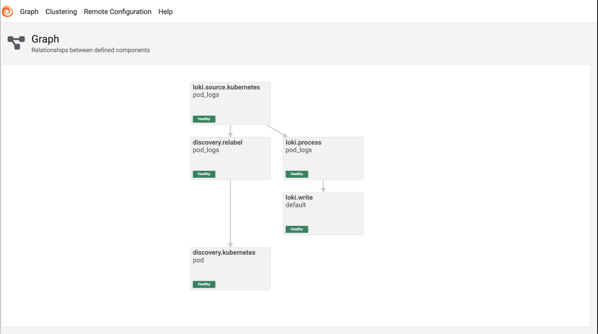
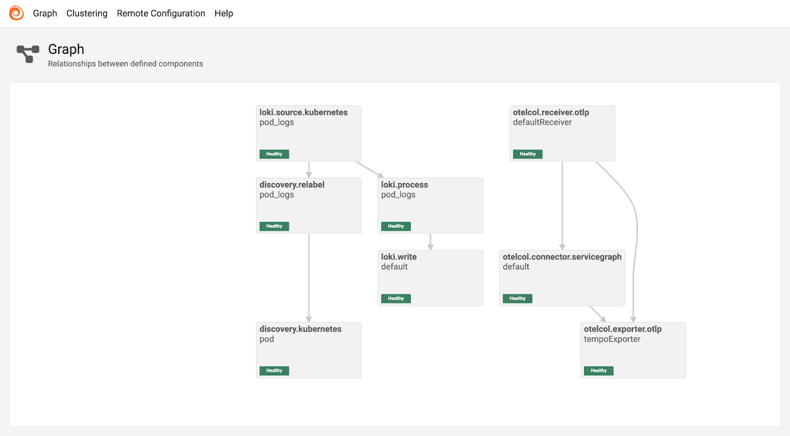
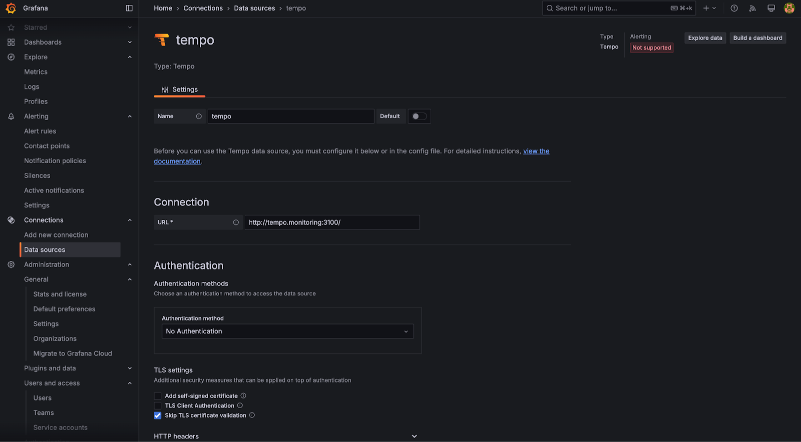

# **Kubernetes Observability Tooling Setup**

#  **Tech Stack Used**

In the context of implementing Kubernetes observability tooling, specifically for logging in SRCNodes, we have opted for the PLG stack—comprising **Prometheus**, **Loki**, and **Grafana**—over the ELK stack (ElasticSearch, Logstash, and Kibana) as of now. This decision was driven by several key factors:

1. **Kubernetes Native**: The PLG stack is inherently designed for Kubernetes environments, offering seamless integration with Kubernetes-based workloads and configurations. This makes it a more natural choice for our observability needs within a Kubernetes cluster.

2. **Simplicity and Efficiency**: The PLG stack is known for its simplicity in setup and operation, while also being highly efficient in handling large volumes of data. It provides a streamlined approach to monitoring and logging, reducing complexity compared to the more generalized ELK stack.

3. **Scalability**: PLG is designed with scalability in mind, which is crucial for managing large-scale Kubernetes deployments. As our observability needs grow, PLG's architecture can easily scale to accommodate increased traffic and data volume.

4. **Performance and Maintenance**: In addition to its ease of use, the PLG stack offers high performance and low resource consumption, making it a better fit. 

### **List of Tools** 

1. Grafana  
2. Prometheus   
3. Loki  
4. Alloy  
5. Tempo  
6. OpenTelemetry Collector

### **Grafana** 

Grafana is an open-source tool used to create visual dashboards for monitoring and analyzing data. It connects to various data sources like Prometheus, Loki and helps you to visualize metrics in real-time. Grafana makes it easy to track performance and identify issues with interactive charts and graphs.

### **Prometheus**

Prometheus is a monitoring and alerting toolkit designed for Kubernetes and cloud-native environments. It collects and stores metrics (data on system performance) over time. Prometheus automatically scrapes data from your services and stores it in a time-series database.

### **Grafana Loki**

Loki is a log aggregation system designed for cloud-native environments, particularly Kubernetes. It efficiently collects, stores, and indexes logs from applications and services. Unlike traditional logging systems, Loki indexes logs by labels (such as application name, pod, or container), rather than the full content of each log line. This approach significantly reduces storage requirements and makes querying faster and more cost-effective.

### **Grafana Alloy**

Grafana Alloy is an open-source distribution of the OpenTelemetry Collector, designed to streamline the collection, processing, and export of telemetry data—including metrics, logs, traces, and profiles—in environments like Kubernetes. It offers native support for both OpenTelemetry and Prometheus telemetry formats.

### **Grafana Tempo**

Grafana Tempo is an open-source, high-scale distributed tracing backend. It enables efficient collection, storage, and analysis of trace data, providing valuable insights into the performance and reliability of distributed systems and it integrates nicely with grafana loki for logs and prometheus for metrics

### **OpenTelemetry Collector**

The OpenTelemetry Collector is a vendor-agnostic tool designed to receive, process, and export telemetry data such as metrics, logs, and traces. When deployed within Kubernetes clusters, it enhances observability by collecting and managing telemetry data from various sources.

# **System Requirements**

To set up the observability stack for SRCNodes, which includes Grafana, Prometheus, Loki, Tempo, Alloy, and OpenTelemetry Collector, ensure that the following hardware and software prerequisites are met.

### **Hardware Requirements** 

	**CPU:** Minimum of 2 cores per node.​  
**Memory:** At least 2 GB of RAM per node  
**Storage:** 20 GB of free disk space per node.  
	**Networking:** Reliable network connectivity between nodes.​

\*  Source of this data is observation and [linuxconfig.org](http://linuxconfig.org)  
\*  Prometheus and Loki will require disk space for storing time-series metrics and logs when they are stored locally instead of cloud services like S3 or GCS.  
\*  Tempo may also require significant storage depending on the retention period for traces.

### **Software Requirements** 

**Kubernetes Cluster:** 1.19+ is required.   
You can use any Kubernetes distribution such as 

- Minikube (for local testing),   
- GKE (Google Kubernetes Engine),   
- EKS (Amazon Elastic Kubernetes Service),   
- or any other cloud or on-premises Kubernetes deployment.

	**Helm:** v3.x (or later) is required  
	**kubectl:** 1.19+ is required  
	**Container Runtime:** any container runtime with supported version

# **Architecture Overview**



In this architecture, we are considering a **Kubernetes cluster** with two distinct namespaces:

1. **Monitoring Namespace**: This namespace is dedicated to deploying the monitoring-related stack, including components such as **Prometheus**, **Loki**, **Tempo**, **Alloy** and **Grafana**.

2. **Playground Namespace**: This namespace is where our test service is deployed. It serves as the target for monitoring and observability tasks, allowing us to collect and visualize metrics, logs, and traces.

The observability workflow encompasses three key paths:

* **Metrics Collection**: Metrics are fetched from **Prometheus** and visualized in **Grafana**.  
* **Log Aggregation**: Logs are gathered by **Loki** and displayed in **Grafana**.  
* **Distributed Tracing**: Traces are collected from **Tempo** and rendered in **Grafana**.

### **Metrics Collection** 	To capture metrics from services into Prometheus, there are several approaches. One method used in this architecture is **Prometheus client integration**. The process involves the following steps:

1. **Install Prometheus Client**: The Prometheus client is installed within the service.  
2. **Configure Metrics and Endpoint**: The client is configured to collect the desired metrics and expose them via a dedicated endpoint.  
3. **ServiceMonitor Creation**: A ServiceMonitor resource is created to enable Prometheus to scrape the metrics at regular intervals.  
4. **Data Storage**: The collected metrics are stored in a Persistent Volume Claim (PVC) for durability.  
5. **Grafana Integration**: Prometheus is added as a data source to **Grafana**, which visualizes and presents the metrics.

With this setup, Prometheus continuously scrapes the metrics from the service, and Grafana allows for real-time visualization of the data.

### **Logs Aggregation**

To capture logs from services running within our Kubernetes cluster, we utilize **Grafana Alloy** in conjunction with **Loki** and **Grafana** for efficient log aggregation and visualization. The log collection and visualization process is as follows:

1. **Deploy Grafana Alloy**: Grafana Alloy is installed within the Kubernetes cluster to collect logs from the pods. It offers flexibility in log collection methods, including using the Kubernetes API to tail logs without requiring a DaemonSet  
2. **Configure Log Collection**: Alloy is configured to collect logs from specific pods or namespaces. This configuration involves setting up the appropriate components within Alloy to discover and tail logs from the desired sources.  
3. **Forward Logs to Loki**: The collected logs are forwarded to **Loki**, a log aggregation system designed for scalability and efficiency. Alloy's loki.write component handles the delivery of logs to Loki endpoints.  
4. **Store Logs in Loki**: Loki stores the logs in an object storage system or persistent volume, ensuring durability and facilitating efficient querying.  
5. **Visualize Logs in Grafana**: **Grafana** is configured to use Loki as a data source. This setup allows for the creation of dynamic dashboards and the execution of queries to analyze and visualize log data in real-time.

### **Distributed Tracing**

To implement distributed tracing within our Kubernetes environment, we utilize **OpenTelemetry** for instrumentation, the **OpenTelemetry Collector** for collecting and exporting trace data, and **Grafana Tempo** for storing and visualizing traces. The process is structured as follows:

1. **Instrument Services with OpenTelemetry SDKs**: Each service in the Playground Namespace is instrumented using OpenTelemetry SDKs. This involves integrating the appropriate OpenTelemetry libraries into the application code to capture trace data, such as request paths, durations, and dependencies.

2. **Enable Auto-Instrumentation (Optional)**: For languages and frameworks that support it, auto-instrumentation is enabled to automatically capture trace data without manual code modifications. This approach simplifies the instrumentation process and ensures consistent trace data collection across services.  
3. **Deploy the OpenTelemetry Collector**: The OpenTelemetry Collector is deployed within the Kubernetes cluster to receive, process, and export trace data. It acts as a telemetry gateway, collecting traces from instrumented services and forwarding them to the tracing backend.  
4. **Configure the Collector to Export Traces to Grafana Tempo**: The Collector is configured with exporters that send trace data to **Grafana Tempo**, our chosen tracing backend. This setup involves specifying the Tempo endpoint and ensuring that traces are transmitted securely and efficiently.  
5. **Visualize Traces in Grafana**: Grafana is configured to connect to Grafana Tempo as a data source. This integration allows for the creation of dashboards that visualize trace data, enabling the monitoring of request flows, identification of performance bottlenecks, and analysis of service dependencies.

	

# **Setting up the PLG Stack** 

### **kube-prometheus-stack:**

To install the `kube-prometheus-stack` with customized configurations, follow these steps:

**1\. Create a Monitoring Namespace:**

```
kubectl create namespace monitoring
```

**2\. Add the Prometheus Community Helm Repository:**

```
helm repo add prometheus-community https://prometheus-community.github.io/helm-charts
helm repo update
```

**3\. Fetch Default Values:**

Retrieve the default values of the `kube-prometheus-stack` Helm chart to customize them as needed:

```
helm show values prometheus-community/kube-prometheus-stack > values.yaml
```

This command saves the default values to a `values.yaml` file, which you can edit to tailor the installation to your requirements.

**4\. Customize values.yaml**

```
prometheus:
  prometheusSpec:
    storageSpec:
      volumeClaimTemplate:
        metadata:
          name: prometheus-pvc
        spec:
          accessModes:
            - ReadWriteOnce
          resources:
            requests:
              storage: 10Gi
          storageClassName: nfs-default
    retention: "720h"  # 30 days retention (720 hours)
    namespaceSelector: {}

grafana:
  persistence:
    enabled: true
    size: 5Gi
    storageClassName: nfs-default
    existingClaim: grafana-pvc

alertmanager:
  alertmanagerSpec:
    storage:
      volumeClaimTemplate:
        metadata:
          name: alertmanager-pvc
        spec:
          accessModes:
            - ReadWriteOnce
          resources:
            requests:
              storage: 5Gi
          storageClassName: nfs-default 
```

**5\. Install the `kube-prometheus-stack` Helm Chart:**

With your customized `values.yaml`, install the Helm chart in the `monitoring` namespace:

```
helm install kube-prometheus-stack prometheus-community/kube-prometheus-stack -n monitoring -f values.yaml
```

**6\. Set Up Gateway API Resources for Grafana Access:**

To access the Grafana dashboard via the Gateway API, define `Gateway` and `HTTPRoute` resources.

```
apiVersion: gateway.networking.k8s.io/v1
kind: Gateway
metadata:
  name: envoy-grafana-gateway
spec:
  gatewayClassName: envoy-gateway-class
  listeners:
  - name: grafana-gateway-http-envoy
    protocol: HTTP
    port: 80
    allowedRoutes:
        namespaces:
          from: All
  - name: grafana-gateway-https-envoy
    protocol: HTTPS
    port: 443
    allowedRoutes:
        namespaces:
          from: All
    hostname: "grafana.e4r.internal"
    tls:
      certificateRefs:
      - kind: Secret
        group: ""
        name: grafana-gateway-tls

---

apiVersion: gateway.networking.k8s.io/v1
kind: HTTPRoute
metadata:
  name: grafana
  namespace: monitoring
spec:
  parentRefs:
    - name: envoy-grafana-gateway # Updated to use the new monitoring-gateway
      namespace: default         # Ensure the gateway is in the monitoring namespace
  hostnames:
    - "grafana.e4r.internal"
  rules:
    - matches:
        - path:
            type: PathPrefix
            value: /
      backendRefs:
        - name: prometheus-stack-grafana
          port: 80
```

**7\. Apply the Gateway API Resources and access the Grafana Dashboard**  
	After applying the Gateway API resources, access the Grafana dashboard at `https://grafana.e4r.internal/grafana`. The default login credentials are:

**Username: `admin`**   
**Password: `prom-operator`**

### **Grafana Tools:**

	To install the Grafana tools with customized configurations, follow these steps

**1\. Add the Grafana Helm Repository:**  
	

```
helm repo add grafana https://grafana.github.io/helm-charts
helm repo update
```

**2\. Grafana Loki:**

There are three different ways of deploying the Grafana Loki, they are 

1. Monolithic  
2. Simple Scalable  
3. Microservice

```
 helm show values grafana/loki > values.yaml
```

This command saves the default values to a `values.yaml` file, which you can edit to tailor the installation to your requirements.  
Customise the values.yaml according to your requirements and in this case, we are installing a simple monolithic version of loki and the values.yaml looks like this

```
loki:
  auth_enabled: false
  commonConfig:
    replication_factor: 1
  schemaConfig:
    configs:
      - from: "2025-04-01"
        store: tsdb
        object_store: s3
        schema: v13
        index:
          prefix: loki_index_
          period: 24h
  pattern_ingester:
      enabled: true
  limits_config:
    allow_structured_metadata: true
    volume_enabled: true
  ruler:
    enable_api: true

minio:
  enabled: true

deploymentMode: SingleBinary

singleBinary:
  replicas: 1

backend:
  replicas: 0
read:
  replicas: 0
write:
  replicas: 0
ingester:
  replicas: 0
querier:
  replicas: 0
queryFrontend:
  replicas: 0
queryScheduler:
  replicas: 0
distributor:
  replicas: 0
compactor:
  replicas: 0
indexGateway:
  replicas: 0
bloomCompactor:
  replicas: 0
bloomGateway:
  replicas: 0
```

Now, we install the Grafana loki with these values as we are willing to deploy it as simple monolithic application in monitoring namespace.

```
helm install loki grafana/loki -n monitoring -f values.yaml
```

Now Select the Data source from Connections in the sidebar in the Grafana dashboard and add loki data source and configure it with loki url which is **[http://loki.monitoring.svc.cluster.local:3100](http://loki.monitoring.svc.cluster.local:3100)**  
In our case, add authentication methods if configured to the Loki and save it.



**3\. Grafana Alloy:**

Installing Alloy using helm is straightforward.

```
 helm show values grafana/alloy > values.yaml
```

This command saves the default values to a `values.yaml` file, which you can edit to tailor the installation to your requirements.  
Customise the values.yaml according to your requirements and in this case

```
alloy:
  configMap:
    content: |-
      loki.write "default" {
        endpoint {
          url = "http://loki.monitoring:3100/loki/api/v1/push"
        }
      }

      discovery.kubernetes "pod" {
        role = "pod"
      }

      discovery.relabel "pod_logs" {
        targets = discovery.kubernetes.pod.targets
        rule {
          source_labels = ["__meta_kubernetes_namespace"]
          action        = "replace"
          target_label  = "namespace"
        }
        rule {
          source_labels = ["__meta_kubernetes_pod_name"]
          action        = "replace"
          target_label  = "pod"
        }
        rule {
          source_labels = ["__meta_kubernetes_pod_container_name"]
          action        = "replace"
          target_label  = "container"
        }
        rule {
          source_labels = ["__meta_kubernetes_pod_label_app_kubernetes_io_name"]
          action        = "replace"
          target_label  = "app"
        }
        rule {
          source_labels = ["__meta_kubernetes_namespace", "__meta_kubernetes_pod_container_name"]
          action        = "replace"
          target_label  = "job"
          separator     = "/"
          replacement   = "$1/$2"
        }
        rule {
          source_labels = ["__meta_kubernetes_pod_uid", "__meta_kubernetes_pod_container_name"]
          action        = "replace"
          target_label  = "__path__"
          separator     = "/"
          replacement   = "/var/log/pods/*$1/*.log"
        }
        rule {
          source_labels = ["__meta_kubernetes_pod_container_id"]
          action        = "replace"
          target_label  = "container_runtime"
          regex         = "^(\\S+):\\/\\/.+$"
          replacement   = "$1"
        }
      }

      loki.source.kubernetes "pod_logs" {
        targets    = discovery.relabel.pod_logs.output
        forward_to = [loki.process.pod_logs.receiver]
      }

      loki.process "pod_logs" {
        stage.static_labels {
          values = {
            cluster = "kubernetes",
          }
        }
        forward_to = [loki.write.default.receiver]
      }
```

Alloy does these things in our case

1. Define Loki Write Endpoint  
2. Enable Kubernetes Pod Discovery  
3. Configure Relabeling for Log Metadata  
4. Define Log Source from Kubernetes Pods  
5. Process Logs Before Writing

In order to easily configure the alloy with various components Grafana Alloy has a open source tool, [https://grafana.github.io/alloy-configurator/](https://grafana.github.io/alloy-configurator/) **\[ Alloy Configurator \]**

Now, we install the Grafana alloy with these values in the monitoring namespace.

```
helm install alloy grafana/alloy -n monitoring -f values.yaml
```

 Grafana Alloy also provides a UI dashboard which should look like this and helps to verify if it’s configured properly.



**4\. Grafana Tempo:**

Grafana Tempo can be installed using Helm, and tracing information can then be provided to it via Grafana Alloy from the services. Optionally, we can install and set up an OpenTelemetry Collector to capture the instrumentation data, which would then be sent to Grafana Alloy. This approach adds an additional step in the pipeline, allowing us to decouple the tracing process or add more flexibility in how traces are fetched from services to Tempo

We need to install Grafana Tempo and update the values of Grafana Alloy to enable the capture of traces from services and write them to Tempo. Afterward, we must add Grafana Tempo as a data source in the Grafana dashboard.

**Installing Grafana Tempo** 

```
helm install tempo grafana/tempo -n monitoring -f tempo-values.yaml
```

Now update the **values.yaml** of Grafana Alloy to allow it to collect and send traces to Tempo, which looks like this,

```
alloy:
  extraPorts:
    - name: "grpc"
      port: 4317
      targetPort: 4317
      protocol: "TCP"
  configMap:
    content: |-
      ... previous config
      otelcol.exporter.otlp "tempoExporter" {
        client {
          endpoint = "tempo.monitoring.svc.cluster.local:4317"
          tls {
            insecure = true
          }
        }
      }
      otelcol.connector.servicegraph "default" {
        dimensions = ["http.method", "http.target"]
        output {
          metrics = [otelcol.exporter.otlp.tempoExporter.input]
        }
      }
      otelcol.receiver.otlp "defaultReceiver" {
        grpc {
          endpoint = ":4317"
        }
        output {
          traces = [
            otelcol.exporter.otlp.tempoExporter.input,
	     otelcol.connector.servicegraph.default.input,
          ]
        }
      }
```

This configuration allows alloy to collect and send instrumentation data from services to grafana tempo.  
Now we have to helm upgrade alloy and we should be able to see the new Alloy dashboard graph like this.  


Now Select the Data source from Connections in the sidebar in the Grafana dashboard and add Tempo data source and configure it with loki url which is **[http://tempo.monitoring.svc.cluster.local:3100](http://loki.monitoring.svc.cluster.local:3100)**  
In our case, add authentication methods if configured to the Loki and save it.  
Also add the trace to logs and trace to metrics data sources, which can be Grafana Loki and Prometheus for trace to metrics and save it.



# **Sample Service with Prometheus and OpenTelemetry SDK**

In the current implementation, logs can be automatically populated with the help of Grafana Alloy. However, for metrics and tracing, we need to install and configure from the respective libraries. To avoid code-level changes, we considered alternatives such as auto-instrumentation for tracing and a sidecar approach, or other alternatives for metrics. For now, we have created two test services in FastAPI (Python) and NodeJs (Javascript) that have Prometheus and OpenTelemetry clients installed. These services will capture metrics and logs and send them to Prometheus and Tempo, respectively.

**Test App for Metrics**

```javascript
const express = require('express');
const http = require('http');
const promClient = require('prom-client');

const collectDefaultMetrics = promClient.collectDefaultMetrics;
collectDefaultMetrics({ register: promClient.register });

const apiHits = new promClient.Counter({
    name: 'api_hits',
    help: 'Number of hits to the API',
});
const httpRequests = new promClient.Counter({
    name: 'http_requests',
    help: 'Number of HTTP requests',
    labelNames: ['route','method', 'status'],
});

const app = express();
const server = http.createServer(app);
server.listen(3000, () => {
    console.log('Server is running on port 3000');
});

app.get('/fast', (_, res) => {
    apiHits.inc();
    httpRequests.inc({ route: '/fast', method: 'GET', status: 200 });
    try{
        console.log('This is a fast request hit!');
        res.send('This is a fast request!');
    } catch (error) {
        logger.error('An error occurred!');
        res.status(500).send('An error occurred!');
    }
});

app.get('/slow', async(_, res) => {
    apiHits.inc();
    httpRequests.inc({ route: '/slow', method: 'GET', status: 200 });
    try {
        console.log('This is a slow request hit!');
        await new Promise(resolve => setTimeout(resolve, 3000));
        res.send('This is a slow request!');
    } catch (error) {
        logger.error('An error occurred!');
        res.status(500).send('An error occurred!');
    }
});

app.get('/metrics', async(_, res) => {
    console.log('This is a metrics request hit!');
    const metrics = await promClient.register.metrics();
    res.setHeader('Content-Type', promClient.register.contentType);
    res.send(metrics);
});
```

When deploying this service make sure to add a ServiceMonitor in order to allow Prometheus to scrape the metrics from the service periodically

```
apiVersion: monitoring.coreos.com/v1
kind: ServiceMonitor
metadata:
  name: k8s-app-http
  namespace: playground
  labels:
    release: prometheus-stack
spec:
  selector:
    matchLabels:
      app: test-app
  endpoints:
  - port: http-metrics
    path: /metrics
    interval: 15s
```

**Test App for Tracing**

```py

import time
import random
import logging
import http.client

from fastapi import FastAPI
from opentelemetry import trace
from opentelemetry.instrumentation.fastapi import FastAPIInstrumentor
from opentelemetry.sdk.trace import TracerProvider
from opentelemetry.sdk.resources import Resource
from opentelemetry.sdk.trace.export import BatchSpanProcessor, ConsoleSpanExporter
from opentelemetry.exporter.otlp.proto.grpc.trace_exporter import OTLPSpanExporter

logging.basicConfig(level=logging.INFO)
logger = logging.getLogger('opentelemetry')
logger.setLevel(logging.INFO)

app = FastAPI()

resource = Resource(attributes={
    "service.name": "test-api-service"
})

provider = TracerProvider(resource=resource)

otel_endpoint_url = "http://otel-collector-opentelemetry-collector.monitoring.svc.cluster.local:4317"
if otel_endpoint_url:
    otlp_exporter = OTLPSpanExporter(endpoint=otel_endpoint_url)
    processor = BatchSpanProcessor(otlp_exporter)
else:
    processor = BatchSpanProcessor(ConsoleSpanExporter())

provider.add_span_processor(processor)

trace.set_tracer_provider(provider)
tracer = trace.get_tracer(__name__)

FastAPIInstrumentor.instrument_app(app)

FAST_API_HOST = "test-app.playground.svc.cluster.local"
SLOW_API_HOST = "test-app.playground.svc.cluster.local"
FAST_API_PORT = 3000
SLOW_API_PORT = 3000

@app.get("/fast")
async def fast_endpoint():
    with tracer.start_as_current_span("fast_operation"):
        print("Fast request started")
        conn = http.client.HTTPConnection(FAST_API_HOST, FAST_API_PORT)
        conn.request("GET", "/fast")
        print("API call to test service started")
        response = conn.getresponse()
        data = response.read().decode('utf-8')
        conn.close()
        print("API call to test service ended")
        print("Fast request completed")
        return {"message": "Fast response"}

@app.get("/slow")
async def slow_endpoint():
    with tracer.start_as_current_span("slow_operation"):
        print("Slow request started")
        conn = http.client.HTTPConnection(SLOW_API_HOST, SLOW_API_PORT)
        conn.request("GET", "/slow")
        print("API call to test service started")
        response = conn.getresponse()
        data = response.read().decode('utf-8')
        conn.close()
        print("API call to test service ended")
        time.sleep(random.uniform(1, 3))
        print("Slow request completed")
        return {"message": "Slow response"}

if __name__ == "__main__":
    import uvicorn
    uvicorn.run(app, host="0.0.0.0", port=8000)
```

# **Official Docs and Helm Charts**

- [https://github.com/prometheus-community/helm-charts/tree/main/charts/kube-prometheus-stack](https://github.com/prometheus-community/helm-charts/tree/main/charts/kube-prometheus-stack)  
- [https://github.com/grafana/helm-charts/](https://github.com/grafana/helm-charts/)  
- [https://github.com/open-telemetry/opentelemetry-helm-charts/tree/main/charts/opentelemetry-collector](https://github.com/open-telemetry/opentelemetry-helm-charts/tree/main/charts/opentelemetry-collector)  
- [https://grafana.com/docs/tempo/latest/getting-started/](https://grafana.com/docs/tempo/latest/getting-started/)  
- [https://grafana.com/docs/alloy/latest/](https://grafana.com/docs/alloy/latest/)  
- [https://grafana.com/docs/loki/latest/](https://grafana.com/docs/loki/latest/)

