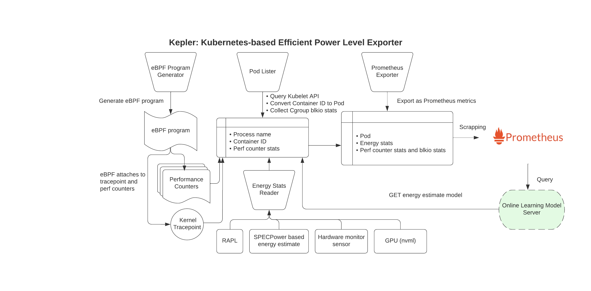

# Kepler: Kubernetes-based Efficient Power Level Exporter

---

## What is Kepler?

**Kepler** stands for **Kubernetes-based Efficient Power Level Exporter**. It is a Prometheus exporter, an open-source project designed to estimate and monitor the energy consumption and CO₂ emissions of workloads running within Kubernetes clusters.
It uses eBPF to monitor CPU performance counters and Linux kernel tracepoints. Data and stats from sysfs can be fed into ML models to estimate energy consumption by Pods.

---

## How Kepler Works?

Kepler uses different methods to collect power data and share it through Prometheus.

### Requirements

| Component            | Requirement                                                                                  |
| -------------------- | -------------------------------------------------------------------------------------------- |
| **Linux Kernel**     | `>= 5.12` (eBPF features used by Kepler require a modern kernel version)                      |
| **eBPF Programs**    | - Must run in **privileged containers**                                                      |
|                      | - Requires **CAP_SYS_ADMIN**, **CAP_BPF** capabilities                                       |
| **Metrics Exporter** | Needs a `ClusterRole` and `RoleBinding` with `get`, `list`, and `watch` on pods, nodes/metrics, nodes/proxy, nodes/stats |
| **Prometheus**       | Prometheus must be configured to scrape Kepler metrics via `ServiceMonitor` |
| **Grafana**          | Prometheus configured as data source                                               |
| **Helm**             | Helm v3 for deploying Kepler and Prometheus stack                                           |

### Data Collection Methods

| Data Source                                | Description                                                  | Permissions Required               |
| ------------------------------------------ | ------------------------------------------------------------ | ---------------------------------- |
| **eBPF (Extended Berkeley Packet Filter)** | Kernel-level monitoring of process counters and system stats | Privileged Container               |
| **Intel RAPL**                             | CPU/DRAM power consumption                                   | Read access to RAPL MSRs           |
| **NVIDIA NVML**                            | GPU power usage data                                         | Requires NVIDIA drivers installed  |
| **SPECPower Estimates**                    | Power usage predicted using benchmark correlations           | No special permissions             |
| **IPMI**                                   | Platform-wide power metrics via firmware interfaces          | May require root / elevated access |

### How ML Models Help

In environments where real-time hardware metrics (e.g., RAPL, NVML) are unavailable, Kepler uses machine learning models (typically regression models) trained on benchmarked datasets like SPECPower.

These models estimate power consumption based on inputs like:

- CPU Cycles
- Memory Usage
- I/O Metrics
- Network Throughput

This ensures broader compatibility, allowing Kepler to work across diverse infrastructure types—even virtual machines or systems without energy interfaces

**Note:** Kepler currently relies heavily on **eBPF** and requires low-level system access (i.e., **privileged container mode**) to function correctly.

---

## Understanding eBPF

**eBPF** (Extended Berkeley Packet Filter) is a technology that allows programs to run in the kernel space of an operating system without modifying the kernel itself.
It enables safe and efficient monitoring and manipulation of kernel behavior.
eBPF programs are attached to various hooks in the kernel, such as system calls, tracepoints, and network events.
When these events occur, the eBPF programs are triggered to execute.

In the context of Kepler, eBPF is used to collect fine-grained power consumption metrics by accessing hardware performance counters and other system statistics. This enables accurate estimation of energy usage at the container level.

---

### Kepler Architecture



_Source: [https://sustainable-computing.io/design/architecture/](https://sustainable-computing.io/design/architecture/)_

---

## Installation of Kepler

Kepler utilizes eBPF to gather detailed power consumption metrics. This requires elevated privileges to load and execute eBPF programs within the kernel.

**Installation Steps**:

1. **Install Prometheus Stack** (if Prometheus isn't already installed):

   ```bash
   helm repo add prometheus-community https://prometheus-community.github.io/helm-charts
   helm repo update
   helm install prometheus prometheus-community/kube-prometheus-stack --namespace monitoring --create-namespace --wait
   ```

2. **Install Kepler**:

   ```bash
   helm repo add kepler https://sustainable-computing-io.github.io/kepler-helm-chart
   helm repo update
   helm install kepler kepler/kepler \
     --namespace monitoring \
     --set serviceMonitor.enabled=true \
     --set serviceMonitor.labels.release=prometheus \
     --set securityContext.privileged=true
   ```

3. **Verify Installation**:

   ```bash
   kubectl get pods -n monitoring
   ```

4. **Integrate with Grafana**:

   1. Import Kepler dashboard JSON into Grafana.
   2. Refresh the browser window to load the new dashboard.

---

## References

- [Kepler GitHub Repository](https://github.com/sustainable-computing-io/kepler)
- [Kepler Installation Guide](https://sustainable-computing.io/installation/kepler-helm/)
- [Kepler Deep Dive](https://sustainable-computing.io/usage/deep_dive/)
- [Kepler on CNCF](https://www.cncf.io/projects/kepler/)
- [Kepler Architecture Overview](https://www.cncf.io/blog/2023/10/11/exploring-keplers-potentials-unveiling-cloud-application-power-consumption/)
- [eBPF Wikipedia](https://en.wikipedia.org/wiki/EBPF)
- [Kepler pod fail when no access to eBPF](https://github.com/sustainable-computing-io/kepler/discussions/1147)
